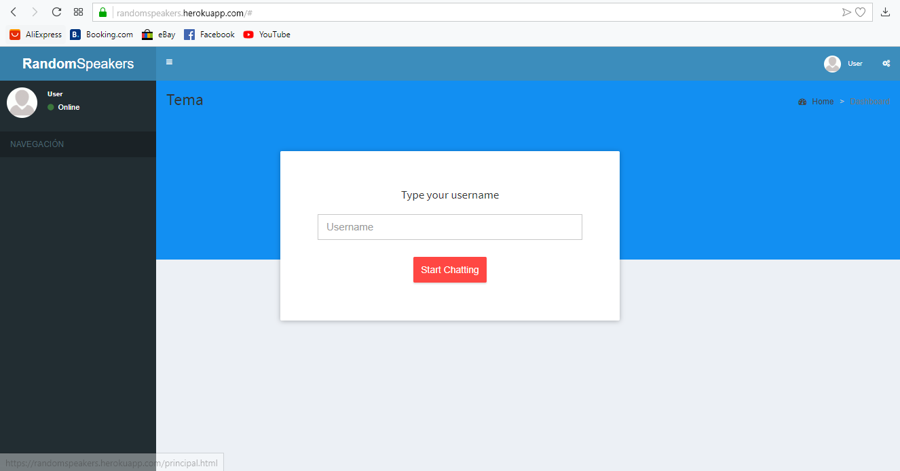
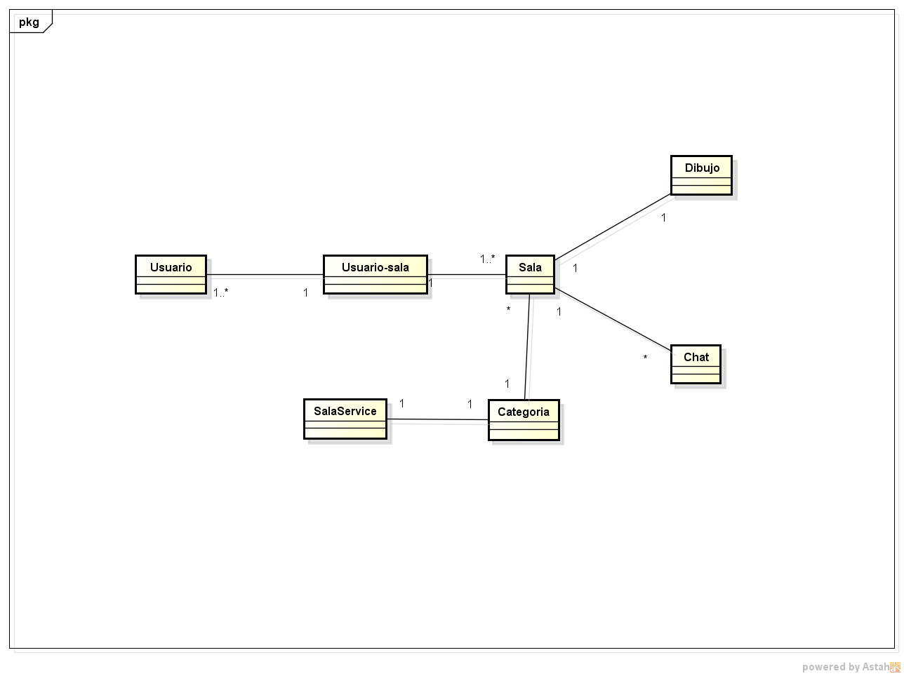
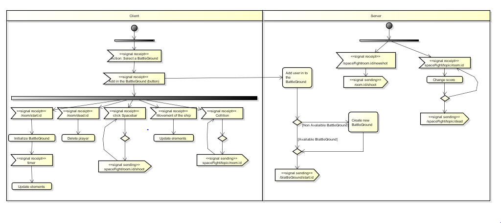
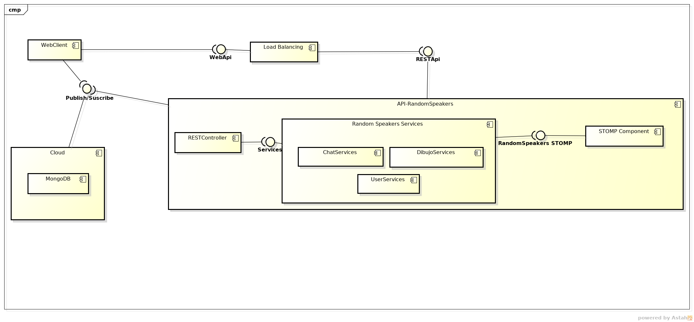
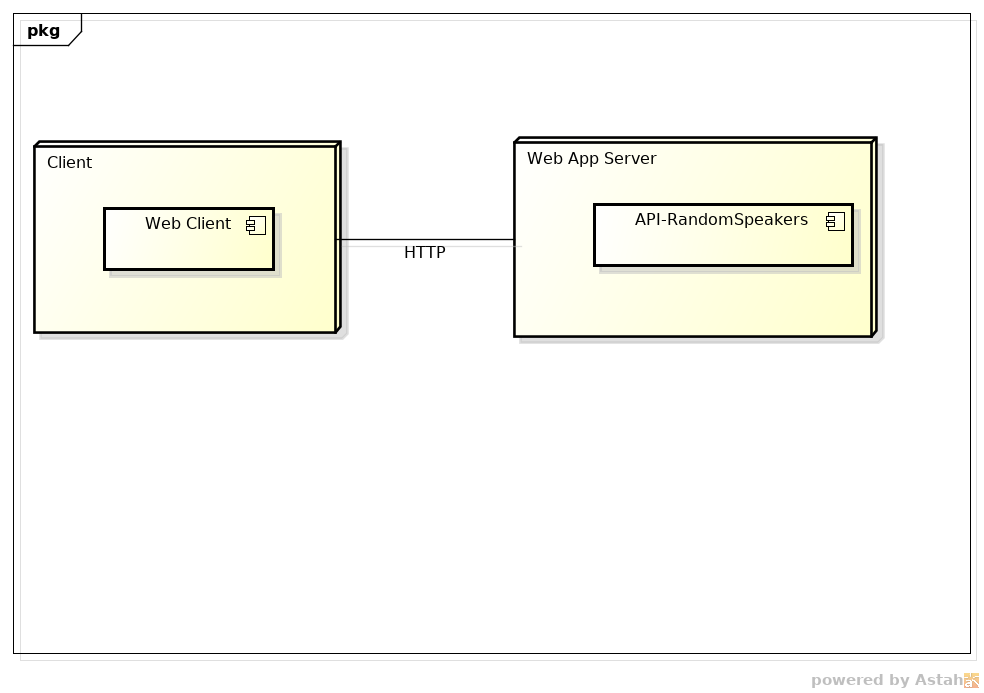
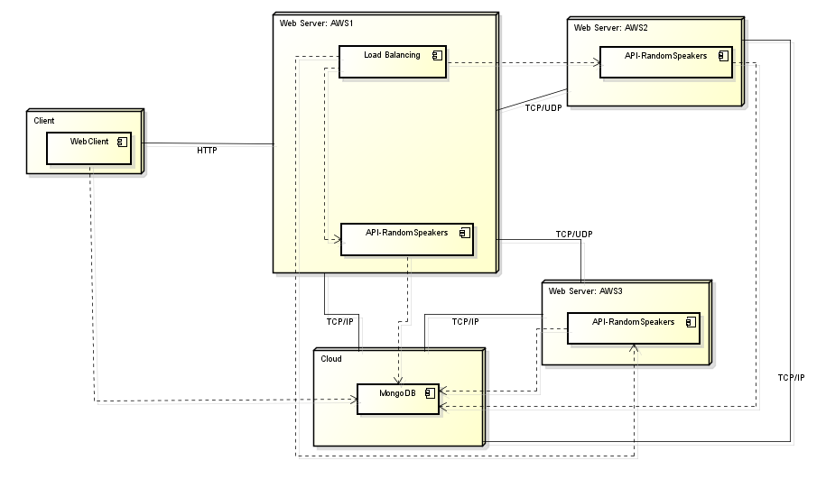

# RANDOM SPEAKERS

Proyecto desarrollado en el periodo académico 2019-1 para el curso Arquitecturas de Software (ARSW)

## Integrantes del proyecto
  - [Juan Felipe Mora][juan]
  - [Alejandra Gómez][alejandra]

## Profesores
  - David Saavedra

## Descripción del producto

Random Speakers es una plataforma que permite la interacción entre varios usuarios, mediante el uso de salas, así mismo permite a los usuarios interactuar con diferentes temas mediante categorías, crear nuevas salas y dibujar de forma colaborativa.

## UI Simulation
HOME

## DIAGRAMAS

### Diagrama de clases

### Diagrama de actividad

### Diagrama de componentes

### Diagrama de despliegue

#### Versión inicial

#### Versión Escalable AWS

*_Vistas:_*
------- 
NINJA MOCK: https://ninjamock.com/s/FM5Z9Sx

   [juan]: <https://github.com/juanmora98>
   [alejandra]: <https://github.com/alejaags>
